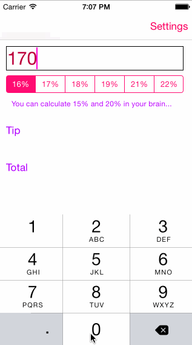
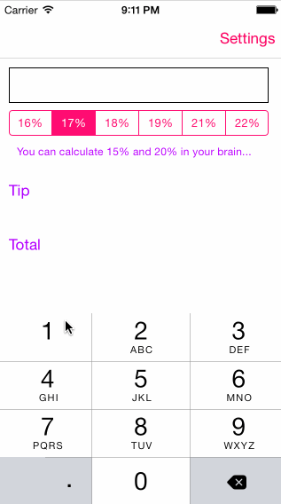

# TipCalculator

This is a Tip Calculator application for iOS submitted as the [pre-assignment](https://gist.github.com/timothy1ee/7747214) requirement for CodePath.

Time spent: about 8

Completed:

* [x] Required: User can enter a bill amount, choose a tip percentage, and see the tip and total values.
* [x] Required: Settings page to change the default tip percentage.
* [x] Optional: UI animations
* [] Optional: Remembering the bill amount across app restarts (if <10mins)
* [] Optional: Using locale-specific currency and currency thousands separators.
* [x] Optional: Making sure the keyboard is always visible and the bill amount is always the first responder. This way the user doesn't have to tap anywhere to use this app. Just launch the app and start typing.

- The initial default tip % is 16%
- The animations are the tip and total which fly in
- The animations fly in slower when you're typing in the tip % while they fly in quicker when you press the % buttons
- The tip % gets changed to 22%. This gets stored even when you close the app
- The tip % does NOT change what the user had selected. See below gif of the correct behavior.
- The tip % gets changed to 18% but the user clicks cancel.
- The keyboard is always visible

- The tip % changes as the settings are saved
- The tip % does not change when you cancel in the settings

Note: to embed the gif file, just check your gif file into your repo and update the name of the file above.
